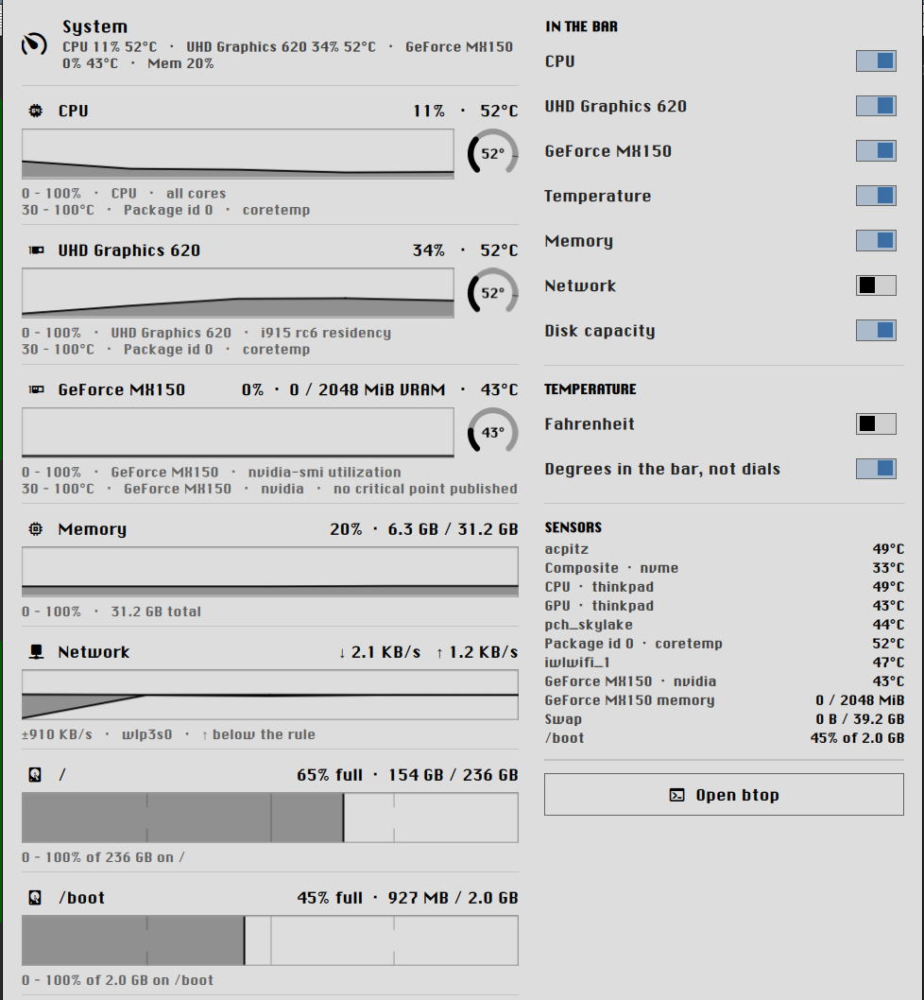

# Binnacle

A strip of live system instruments for the [Omarchy](https://omarchy.org) bar, with a
click-through detail panel.



Binnacle does not ship a list of things it expects your machine to have. It looks, and
then builds instruments for whatever it finds — every GPU, every populated thermal
sensor, every mounted filesystem — and labels each one the way the kernel already names
it.

## What makes it different

**It discovers instead of assuming.** Labels come from `tempN_label` and `lspci`, never
from a table inside the plugin. Your package sensor is called `Package id 0 · coretemp`
because that is what your kernel calls it. A ThinkPad's EC sensors show up as
`CPU · thinkpad` and `GPU · thinkpad`; an NVMe drive as `Composite · nvme`.

**Presence is membership.** A machine with no discrete GPU emits no discrete-GPU entry —
it does not draw a graph pinned at zero and label it with a vendor you do not have. The
same holds for sensors, filesystems and integrated graphics.

**Per-sensor limits.** Each dial scales to its own critical point, read from sysfs. An
NVMe drive that crits at 87 °C is not drawn against a CPU's 100 °C ceiling, and a sensor
that publishes no critical point says so rather than inventing one.

**CPU accounting that survives process exit.** The leaderboard ranks what actually used
the CPU over the last window, using cgroup v2 counters. Sampling `/proc` per PID cannot
see a process that has already exited — measured on the development machine, 76 % of the
CPU burned in one window was unattributable to any surviving PID. Builds, scripts and
bursts are exactly the things that finish before you look at them, and they are exactly
what this catches.

**It stays out of the way.** One long-lived collector, not a process per sample, and
exactly one collector no matter how many monitors you have — the data plane is a
single shell-wide service, so a three-monitor setup samples your machine once, not three
times. Steady state is roughly 7 ms of CPU per second — about 0.7 % of one core —
including the render path. Panel contents are not instantiated while the panel is closed.

## Install

```bash
omarchy plugin add https://github.com/caariiboouu/binnacle --enable
```

Then pick a bar section when prompted, or place it later from **Setup → Plugins**.

## Remove

```bash
omarchy plugin remove com.cuthriell.binnacle
```

That deletes the plugin directory and drops it from your bar layout. Binnacle writes no
files outside its own directory, so nothing else needs cleaning up.

To disable it without uninstalling:

```bash
omarchy plugin disable com.cuthriell.binnacle
```

## Requirements

Required: Omarchy 4 (Quickshell shell), `bash`, `grep`, `df`. All present on a stock
install.

Optional, and absent gracefully:

| Tool | Used for | Without it |
|---|---|---|
| `lspci` | human-readable GPU names | falls back to `Intel integrated graphics` etc. |
| `nvidia-smi` | NVIDIA load, temperature, VRAM | no discrete-GPU instrument is created |
| cgroup v2 with the `cpu` controller | the CPU-by-program leaderboard | leaderboard section is omitted |
| `btop` | the **Open btop** button | button still shown; launch does nothing |

## Settings

Configurable from **Setup → Plugins**, or inline on the widget's `shell.json` entry.

Each instrument can be placed independently:

- **Bar + panel** — drawn in the bar strip and in the dropdown
- **Panel only** — kept out of the strip, still in the dropdown
- **Hidden** — not collected for display at all

Covering CPU, integrated GPU, discrete GPU, temperatures, memory, network and
filesystems. If every instrument is demoted the widget still renders a single glyph, so
the panel stays reachable.

**Temperature** has its own two switches in the dropdown, under the instrument toggles:

- **Celsius / Fahrenheit** — the unit for every displayed reading. The dial scales stay
  physical (a sensor's real critical point), so only the numbers convert.
- **Dial / Degrees in the bar** — whether the bar strip draws a temperature as an arc
  dial or as the reading itself (`62°`). The dropdown always shows the exact number.

Other settings: sample interval, history length per graph, graph width, icon size,
network graph floor, temperature dial floor and ceiling, and the leaderboard window.

## Scripting

Binnacle exposes an IPC target, so placement and presentation can be driven from a
script or a keybinding. Keys are the instrument families (`cpu`, `igpu`, `dgpu`, `mem`,
`net`, `t:` for temperatures, `cap:` for filesystems).

```bash
omarchy-shell com.cuthriell.binnacle open           # open the detail panel
omarchy-shell com.cuthriell.binnacle.bar hide net   # demote an instrument to the panel
omarchy-shell com.cuthriell.binnacle.bar show net   # and back
omarchy-shell com.cuthriell.binnacle.bar set tempUnit Fahrenheit
omarchy-shell com.cuthriell.binnacle.bar set tempStyle Degrees
omarchy-shell com.cuthriell.binnacle.bar metrics    # collector + panel state, as JSON
```

Every write is validated against the settings schema, so a typo is a no-op rather than a
malformed `shell.json` entry.

## How it works

`binnacle-collect` runs once at startup to discover what the machine has, then streams
one JSON line per interval on stdout. The QML reads it with a `SplitParser`. Discovery
costs are paid once; a steady-state tick executes no external programs at all.

Expensive sources are handled by measurement rather than assumption: each thermal sensor
is timed at discovery and anything slow gets its own slower cadence — on the development
machine the NVMe composite sensor costs 7.3 ms per read against 0.4 ms for coretemp,
because it issues a SMART command to the drive.

`grep -r` over `/sys/fs/cgroup` and, on NVIDIA machines, a long-lived `nvidia-smi -l`
reader are the two places the collector deliberately spends: both were measured to be
cheaper than the alternatives (a bash walk of the cgroup tree, and a fresh `nvidia-smi`
per sample), and the reasoning is written out at each site in `binnacle-collect`.

### Hardware coverage

Developed and measured on an Intel + NVIDIA (Optimus) ThinkPad. The Intel and NVIDIA
paths are exercised daily. **The AMD path is written from the sysfs contract but has not
been tested on real AMD hardware** — integrated-vs-discrete classification falls back to
a VRAM-size heuristic when the PCI bus is ambiguous, and an AMD GPU's thermal sensor is
tied to its card by PCI address. If you run AMD and something is misfiled, the reading is
still correct; only the icon or strip order would be wrong. Reports are very welcome.

To see what Binnacle found on your machine:

```bash
~/.config/omarchy/plugins/com.cuthriell.binnacle/binnacle-collect --discover
```

## Privileges

None. Binnacle needs no elevated privileges, ships no compiled binaries, and makes no
network connections.

The only file it writes is your `shell.json`, and only when you act — flipping a bar
toggle or a temperature switch, or calling the IPC. Each write goes through the shell's
own `mutateShellConfig` (the same API the bar uses to persist a drag-and-drop) and
touches only this widget's own entry. Nothing is written on install, on start, or in the
background.

## License

MIT — see [LICENSE](LICENSE).
